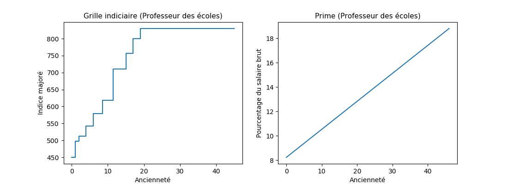
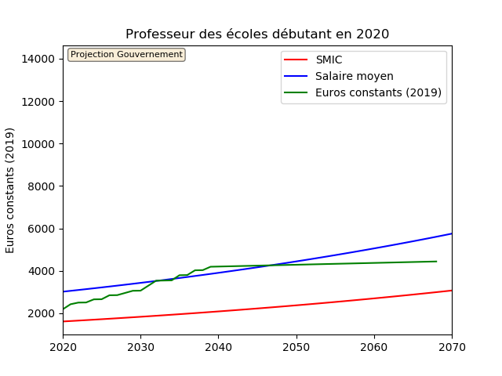
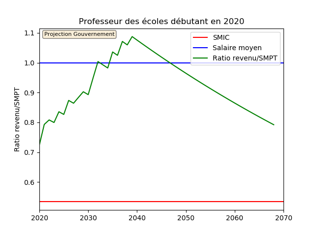
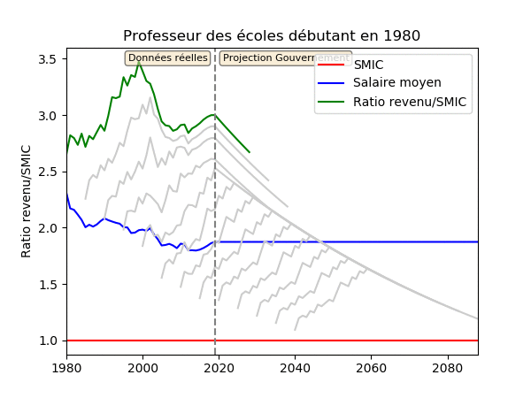

# Réforme des retraites: prolongement du mauvais traitement des professeurs des écoles

*Les hypothèses des projections du gouvernement dans ses cas-types censés illustrer la réforme des retraites impliquent un décrochage de tous les métiers de la fonction publique, décrochage qui prolongerait celui qui a eu lieu ces 40 dernières années. Avec infographies.*

Dans la fiche méthodologique de ses cas-types, le gouvernement fait les hypothèses suivantes:

A inflation neutralisée, il y aurait

- augmentation de 1,3% par an de tous les salaires du privé, dont SMIC et salaire moyen, liée à la croissance ;
- augmentation des salaires des fonctionnaires via celle du taux de prime, qui serait de 0.23 points par an (la valeur du point d'indice étant indexé sur l'inflation, son augmentation est neutralisée si l'inflation l'est également).

Considérons un professeur des écoles qui commence sa carrière en 2020 à 22 ans, passe hors-classe après 23 ans. Supposons que le système de retraites à points est en place tout au long de sa carrière [(1)](#note1). Les graphiques ci-dessous montrent sa progression de carrière prévue en terme de l'évolution 1) de son indice majoré  2) de son taux de prime en fonction de son ancienneté.

A partir de ces informations, on peut en déduire l'évolution de son salaire brut tout au long de sa carrière en euros constants 2019 sous les hypothèses macro-économiques du gouvernement sur l'avenir. C'est ce qui est représenté dans le graphique ci-dessous, avec en plus le niveau du SMIC (en rouge) et du salaire moyen (en bleu) pendant ces années.

La légère (et presque imperceptible) croissance du salaire à échelon fixe (on la distingue visuallement essentiellement à l'échelon terminal) est liée à la promesse d'augmentation du taux de prime de 0.23 points par an. 

Enfin, on peut représenter exactement la même information en regardant le salaire de ce professeur des école divisé par le salaire moyen en France. Voila ce que l'on obtient:

Cette dernière représentation est intéressante pour deux raisons:

- Elle donne une mesure de l'attractivité du salaire de professeur des écoles par rapport aux salaires de tous les autres métiers de la société. Autrement dit, cela donne une **mesure de la reconnaissance de la société vis-à-vis de ce métier**. Ainsi, un professeur des écoles commence sa carrière à 65% du salaire moyen; tant qu'il monte en échelons, son salaire monte progressivement, jusqu'à 90% du salaire moyen. Enfin, à l'échelon terminal, son salaire redescend progressivement jusqu'à 80% du salaire moyen.

- La valeur du point dans la *retraite Macron* est censée être indexée sur le salaire moyen [(2)](#note2), et le nombre de *points retraite* acquis chaque année est proportionnel au salaire. Par conséquent, **la forme de la courbe du salaire ci-dessus coïncide *exactement* avec la forme de la courbe du nombre de *points retraite* obtenus tout au long de la vie active**. Année après année, le professeur des écoles gagnerait de plus en plus de points tant qu'il monte en échelons, puis de moins en moins de points jusqu'à atteindre la fin de sa carrière.

Cette forme en *V inversé* du salaire d'un professeur des écoles au long de sa carrière est intimimement liée à sa grille indiciaire (pour la partie montante) et au décrochage du point d'indice par rapport au salaire moyen (pour la partie descendante, à l'échelon terminal).

Maintenant que nous avons fait ces premières observations, il est intéressant de prendre un peu de recul et de regarder l'**évolution de la carrière d'un professeur des écoles en fonction de l'année à laquelle il commence sa carrière** (pour l'instant nous nous sommes focalisés sur le seul cas où le début de carrière est en 2020). L'infographie ci-dessous montre cette évolution: on y représente plusieurs carrières qui diffèrent uniquement par l'année de début, en se focalisant dynamiquement (en vert) sur chacune de ces carrières:

Avec le décrochage du point d'indice par rapport au salaire moyen considéré par le gouvernement, on s'aperçoit que **plus la carrière commence tard, moins elle sera intéressante du point de vue du ratio salaire/(salaire moyen)**. Ainsi, **tous les professeurs des écoless qui débuteraient leur carrière à partir de 2035 seraient au SMIC en début de carrière**. Ces simulations montrent objectivement l'absence de reconnaissance du gouvernement envers le métier de professeur.

Ce phénomène n'est pas nouveau (ni d'ailleurs directement lié à la réforme des retraites). **Une telle dévalorisation de ce métier serait, malheuresement, dans la continuité des politiques salariales envers les fonctionnaires depuis de nombreuses années.** Si l'on trace le même genre de courbes, en commençant à regarder les carrières qui ont débuté en 1980 (entre 1980 et aujourd'hui, on utilise les données réelles et non plus des projections), voila ce qu'on obtient:

Dans ce graphique, nous avons ajouté (courbes en traits d'union) des
simulations de la *retraite Macron* basées sur les *points retraite*
acquis tout au long de la carrière, *sous l'hypothèse d'un âge-pivot
fixe de 65 ans [(3)](#note3)*. Pour chaque carrière, nous représentons
différentes retraites possibles selon que l'âge de départ est 60, 62,
64, 66 ou 68 ans; nous exhibons également le taux de remplacement brut
(c'est-à-dire le rapport entre la retraite brute et le dernier salaire
brut).

Tout d'abord, on observe dans l'infographie ci-dessus ce que nous
annoncions plus haut: la dévalorisation salariale du métier de
professeur des écoles n'est pas nouvelle et date au moins
de 1980. **Un professeur des écoles qui commençait sa carrière en 1980
débutait au niveau du salaire moyen. Un collègue qui commence aujourd'hui est à
60% du salaire moyen, soit un fort décrochage**. Dans un tel contexte, on comprend les régulières demandes de revalorisation de cette population.

Ensuite, de manière un peu préoccupante, **on observe pour les périodes de
fin de vie un décrochage des pensions par rapport au salaire moyen**,
similaire à celui déja décrit, notamment pour le salaire du fonctionnaire au
dernier échelon. La raison est identique: le décrochage est lié au
fait que les pensions sont indexées sur l'inflation, ce qui les fait décrocher
par rapport au salaire moyen et au SMIC qui croissent plus vite. **Corriger ces décrochages pourrait se faire en revalorisant le point d'indice des fonctionnaires et le montant des retraites en proportion du salaire moyen.**

Enfin sur la *retraite Macron*, on observe un taux de remplacement
brut qui pourrait paraître, à première vue, raisonnable (en
particulier autour d'un départ près de l'âge-pivot); Mais il est assez
facile d'avoir un bon taux de remplacement, lorsque la carrière a été
dévalorisée avec autant d'ampleur et que le profil de carrière a cette
forme en V inversé, c'est-à-dire décroissante sur la fin. Si le gouvernement trouvait le moyen de faire chuter le
denier salaire jusqu'à 0, on obtiendrait un taux de remplacement infini!
**Le professeur des écoles qui commence à travailler après 2005
et partirait à la retraite à 68 ans (c'est-à-dire avec une surcote
+15% pour le "féliciter" d'avoir travaillé 3 ans de plus que l'âge-pivot de 65
ans) aurait un joli taux de remplacement de 83%... mais passerait
toute sa retraite avec une pension sous le SMIC**. 

*Note finale:* L'intégralité des images et infographies ci-dessus à été produite à l'aide d'un programme informatique dont le code source est [_public_](), contrairement à ce qu'a fait jusqu'à présent le gouvernement lorsqu'il diffuse des informations techniques. J'invite toute personne à aller regarder le détail des calculs et à me signaler toute erreur, que je m'engage, bien évidemment, à corriger.

- - - 

(1) Nous faisons cette hypothèse simplificatrice car la fiche méthodologique du gouvernement ne décrit pas très précisément la transition entre le système de retraites actuel et le système à points. Cette hypothèse sera, en l'état, vraie pour tous les Français qui commenceront à travailler à partir de 2027. 

(2) C'est ce qui est prévu dans le projet de loi. Cependant, de même que le point d'indice qui est censé être indexé sur l'inflation a été gelé ces dernières années pour *raisons budgétaires*, le point pourra décrocher du salaire moyen (ce qui est d'ailleurs probable, étant donnée que la loi considère  de maintenir l'équilibre financier en permanence sur une fenêtre de 5 ans, c'est-à-dire à très court terme). 

(3) Nous faisons ici la même hypothèse que le gouvernement dans ses cas-types. En réalité, l'âge pivot devrait augmenter, ce qui aura pour effet de réduire les pensions (à âge de départ donné).
